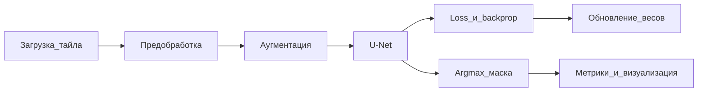

# КУРСОВОЙ ПРОЕКТ

## Титульный лист

Министерство науки и высшего образования Российской Федерации  
ФГБОУ ВО «[Полное наименование вуза]»  
[Факультет / институт]  
Кафедра [название кафедры]

**КУРСОВОЙ ПРОЕКТ**

по дисциплине «Нейросетевые технологии анализа данных в сельском хозяйстве»

на тему:  
**«Обработка спутниковых снимков посредством нейронных сетей»**

Выполнил: студент группы **[Группа]**, курс 4  
**[ФИО студента]**

Руководитель: **[должность, уч. степень, ФИО руководителя]**

[Город] — 2026

---

## Содержание

1. Введение ............................................................... 3  
2. Глава 1. Теоретические основы обработки спутниковых снимков нейронными сетями  
 1.1. Данные дистанционного зондирования Земли и представление спутникового снимка  
 1.2. Классические и нейросетевые методы обработки изображений ДЗЗ  
 1.3. Архитектуры свёрточных сетей: CNN, VGG, ResNet и U-Net  
 Выводы по главе 1  
3. Глава 2. Разработка метода сегментации земного покрова для сельскохозяйственного мониторинга  
 2.1. Требования к задаче сегментации земного покрова в сельском хозяйстве  
 2.2. Обоснование выбора архитектуры U-Net  
 2.3. Алгоритм пайплайна обработки спутниковых данных  
 Выводы по главе 2  
4. Глава 3. Программная реализация и экспериментальное исследование  
 3.1. Инструменты и программная среда  
 3.2. Датасет, предобработка и аугментации  
 3.3. Обучение модели U-Net  
 3.4. Метрики качества и визуализация результатов сегментации  
 Выводы по главе 3  
5. Заключение  
6. Список использованных источников  
7. Приложения  

*Примечание.* Номера страниц ориентировочные; при переносе в Word/LibreOffice обновить автоматически.

---

# Введение

Глубокое обучение (Deep Learning) существенно изменило практику анализа визуальных данных. Свёрточные нейронные сети (CNN) эффективно обрабатывают изображения как двумерные пространственные сигналы или трёхмерные тензоры (для цветных и мультиспектральных снимков) и обладают свойством устойчивости к сдвигам (*shift invariance*), что критично, когда положение объектов на сцене может меняться [1, 12].

Актуальность темы обусловлена ростом объёмов данных дистанционного зондирования Земли (ДЗЗ) и потребностью сельского хозяйства в оперативном мониторинге угодий, водных объектов, лесных массивов и застройки. Ручная интерпретация снимков не масштабируется на регулярное обновление карт земного покрова; нейросетевая семантическая сегментация позволяет автоматизировать выделение классов «посевы/поля», «лес», «вода», «застройка» и др.

**Объект исследования** — процессы обработки и анализа спутниковых изображений земной поверхности методами нейронных сетей.

**Предмет исследования** — методы и алгоритмы семантической сегментации земного покрова на спутниковых снимках на основе архитектуры U-Net для задач сельскохозяйственного мониторинга.

**Цель работы** — разработать и программно реализовать метод сегментации земного покрова по спутниковым снимкам на основе U-Net и оценить его качество по метрикам IoU, Dice и accuracy.

Для достижения цели поставлены следующие **задачи**:

1. Проанализировать теоретические основы ДЗЗ, методов обработки изображений и архитектур свёрточных сетей (CNN, VGG, ResNet, U-Net).  
2. Сформулировать требования к сегментации земного покрова для сельхоз-мониторинга и обосновать выбор U-Net.  
3. Разработать пайплайн предобработки, обучения и инференса модели сегментации.  
4. Реализовать программный прототип на Python (TensorFlow/Keras, NumPy, OpenCV) и провести вычислительный эксперимент на воспроизводимом наборе патчей land-cover типа.  
5. Оценить качество по IoU, Dice, accuracy, визуализировать маски и сформулировать выводы и перспективы развития (в том числе оценка неопределённости и суперразрешение на базе GAN).

**Методы исследования:** анализ научной литературы; методы цифровой обработки изображений; обучение с учителем; свёрточные нейронные сети; семантическая сегментация; вычислительный эксперимент; сравнительная оценка метрик качества.

**Практическая значимость** работы состоит в демонстрации автоматизированного пайплайна обработки данных ДЗЗ для мониторинга сельскохозяйственных угодий: оперативное картирование посевов/полей, воды, леса и застройки со снижением трудозатрат на ручную разметку.

---

# Глава 1. Теоретические основы обработки спутниковых снимков нейронными сетями

## 1.1. Данные дистанционного зондирования Земли и представление спутникового снимка

Дистанционное зондирование Земли (ДЗЗ) — совокупность методов получения информации о поверхности планеты без непосредственного контакта измерительной аппаратуры с объектом наблюдения. Одним из основных носителей такой информации являются оптические мультиспектральные спутниковые снимки. Типичным примером современной съёмочной системы служит миссия Sentinel-2 Европейского космического агентства (ESA), обеспечивающая регулярное покрытие суши данными в видимом и ближнем инфракрасном диапазонах [10, 14].

С точки зрения цифровой обработки изображений спутниковый снимок представляет собой результат дискретизации непрерывного поля яркости: непрерывная функция интенсивности заменяется сеткой пикселей с конечным пространственным разрешением. В контексте машинного обучения такой снимок удобно рассматривать как многомерный тензор размерности \(H \times W \times C\), где \(H\) и \(W\) — высота и ширина в пикселях, а \(C\) — число спектральных каналов (для цветного RGB-изображения \(C = 3\); для мультиспектральных продуктов Sentinel-2 величина \(C\) может быть существенно больше) [1].

Спектральные каналы критичны для отделения типов земного покрова: вегетационные индексы и различия в отражении позволяют отличать посевы и лес от воды и застройки. Пространственное разрешение определяет минимальный размер объектов, которые можно устойчиво выделять на карте (границы полей, водоёмы, кварталы застройки). На практике крупные сцены разрезают на тайлы (патчи) фиксированного размера — например, \(256 \times 256\) пикселей, — чтобы подавать данные в нейронную сеть пакетами (batch) и укладываться в ограничения оперативной памяти.

Для задач сельскохозяйственного мониторинга данные ДЗЗ используются для оперативного картирования угодий, контроля структуры посевных площадей, выявления водных объектов и участков застройки, граничащих с полями. Автоматизация интерпретации снимков становится необходимой по мере роста объёмов архивов и требований к оперативности обновления карт покрова.

**Таблица 1.1 — Примеры каналов Sentinel-2, релевантных для сельскохозяйственного мониторинга**

| Канал (обозначение) | Диапазон (ориентир) | Назначение в с/х-анализе |
|---------------------|---------------------|---------------------------|
| B2 (Blue) | ~490 нм | атмосфера, вода, общая цветопередача |
| B3 (Green) | ~560 нм | растительность, визуализация |
| B4 (Red) | ~665 нм | хлорофилл, контраст посевов |
| B8 (NIR) | ~842 нм | вегетация, отделение леса/посевов |
| B11 (SWIR) | ~1610 нм | влажность, почва, контраст покрытий |

*Рисунок 1.1.* Схема представления спутникового снимка как тензора \(H \times W \times C\): по осям — пространственные координаты пикселей и спектральные каналы.  
**Файл для вставки:** `Материалы_для_вставки/Изображения/Рис_1_1_тензор_снимка.png`

## 1.2. Классические и нейросетевые методы обработки изображений ДЗЗ

Обработка спутниковых изображений включает ряд типовых операций, которые в классической компьютерной графике и в машинном обучении описываются близкими терминами, но реализуются по-разному.

**Фильтрация** — преобразование изображения с целью подавления шума, удаления выбросов и нетипичных значений яркости, а также выделения структур (границ, текстур). Качественная фильтрация повышает устойчивость последующей классификации и сегментации.

**Сегментация** — разбиение изображения на однородные по смыслу области; в задаче картирования земного покрова это попиксельная разметка, позволяющая выделить контуры полей, лесных массивов, водоёмов и застройки.

**Классификация** — отнесение всего снимка, его фрагмента или отдельного пикселя к одной из заранее заданных категорий (например, «лес», «вода», «посевы»).

Перед подачей данных в модель выполняют предобработку: нормализацию контраста (глобальную или локальную) и приведение яркостей пикселей к единому диапазону (часто \([0, 1]\) либо стандартизация по среднему и дисперсии обучающей выборки). Это стабилизирует обучение градиентными методами [1].

Классические подходы к сегментации и классификации опираются на ручные признаки (текстуры, спектральные индексы, пороговые правила). Они прозрачны, но плохо масштабируются на большие массивы ДЗЗ и чувствительны к вариациям освещённости и фенологическим изменениям. Свёрточные нейронные сети (CNN) обучают иерархию признаков непосредственно по данным, что позволяет автоматизировать анализ визуальной информации на уровне, ранее труднодостижимом для классических алгоритмов [1, 12].

**Таблица 1.2 — Сравнение классических методов и CNN для обработки ДЗЗ**

| Критерий | Классический подход | Свёрточная нейросеть |
|----------|---------------------|----------------------|
| Признаки | задаются экспертом | обучаются автоматически |
| Масштабируемость | ограничена правилами | высокая при наличии разметки |
| Устойчивость к вариациям | часто низкая | выше при аугментациях |
| Требования к данным | меньше размеченных примеров | нужна обучающая выборка |
| Интерпретация | правила понятны | требуется анализ масок/ошибок |

*Рисунок 1.2.* Пример цепочки: исходный фрагмент → нормализованное изображение → эталонная маска классов земного покрова.  
**Файл для вставки:** `Материалы_для_вставки/Изображения/Рис_1_2_предобработка_и_маска.png`

## 1.3. Архитектуры свёрточных сетей: CNN, VGG, ResNet и U-Net

**Свёрточные нейронные сети (CNN).** CNN — специализированная архитектура для данных с сеточной топологией. Они используют локальные рецептивные поля и разделяемые веса, что снижает число параметров и обеспечивает инвариантность к сдвигам — свойство, критичное для анализа снимков, где положение объекта может меняться [1]. Базовый блок включает свёртку, нелинейную активацию (например, ReLU) и операцию пулинга (субдискретизации). Пулинг уменьшает пространственную размерность карт признаков и усиливает устойчивость к малым искажениям. Иерархия признаков формируется постепенно: от границ и текстур к частям объектов и целым структурам сцены.

Теоретическая база многослойного обучения с учителем и обратного распространения ошибки подробно изложена у С. Хайкина; идеи локальной связности и иерархического извлечения признаков восходят к линии моделей типа Neocognitron и современных CNN [1].

**VGG.** Архитектура VGG демонстрирует эффективность стеков свёрток с фильтрами \(3 \times 3\): увеличение глубины при малых ядрах позволяет строить выразительные представления при контролируемом росте числа параметров [3]. Такие блоки часто используют как «строительный материал» энкодеров.

**ResNet (остаточные сети).** При чрезмерном увеличении глубины обучение может деградировать из-за затухания градиента. ResNet вводит сквозные (skip) соединения, суммирующие вход блока с его преобразованным выходом, что позволяет обучать очень глубокие сети [4]. Остаточные блоки применяют в энкодерах сегментационных моделей.

**U-Net.** U-Net — архитектура типа encoder–decoder, изначально предложенная для биомедицинской сегментации и широко адаптируемая к задачам ДЗЗ [2]. Энкодер сжимает пространственное разрешение и извлекает признаки; декодер восстанавливает размерность до исходной карты; боковые skip-connections передают детальную пространственную информацию и улучшают локализацию границ. На выходе формируется плотная карта классов (семантическая сегментация). Обучение ведётся с учителем: минимизируется функция потерь (часто categorical cross-entropy, иногда в комбинации с Dice loss).

**Таблица 1.3 — Роль архитектур в задачах анализа изображений**

| Архитектура | Типичная роль | Выход |
|-------------|---------------|-------|
| CNN (базовая) | извлечение признаков | карты признаков / класс кадра |
| VGG | глубокий энкодер из блоков \(3\times3\) | вектор/карты признаков |
| ResNet | сверхглубокий энкодер со skip | устойчивые признаки |
| U-Net | плотная сегментация сцены | маска \(H\times W\) классов |

*Рисунок 1.3.* Блок «свёртка → ReLU → pooling».  
**Файл для вставки:** `Материалы_для_вставки/Изображения/Рис_1_3_блок_CNN.png`  

*Рисунок 1.4.* Схема U-Net: encoder / bottleneck / decoder и skip-connections (см. реализацию в приложении А).  
**Файл для вставки:** `Материалы_для_вставки/Изображения/Рис_1_4_схема_UNet.png`

### Выводы по главе 1

1. Спутниковый снимок ДЗЗ корректно моделируется как тензор \(H \times W \times C\); спектральные каналы и разрешение определяют информативность для сельхоз-мониторинга.  
2. Фильтрация, сегментация и классификация образуют базовый словарь обработки; для больших массивов данных перспективна автоматизация на основе глубокого обучения.  
3. CNN, VGG и ResNet обеспечивают иерархию признаков; архитектура U-Net является естественным выбором для попиксельной семантической сегментации земного покрова.

---

# Глава 2. Разработка метода сегментации земного покрова для сельскохозяйственного мониторинга

## 2.1. Требования к задаче сегментации земного покрова в сельском хозяйстве

Цель прикладного мониторинга в рамках курсового проекта — автоматическое построение карты классов земного покрова по фрагменту спутникового снимка. Фиксируется набор из пяти классов:

**Таблица 2.1 — Классы сегментации и цветовая легенда маски**

| Код | Класс | Цвет (RGB) | Смысл для с/х-мониторинга |
|-----|-------|------------|---------------------------|
| 0 | прочее | (120, 120, 120) | фон, почва, неразмеченные области |
| 1 | посевы/поля | (210, 180, 60) | сельскохозяйственные угодья |
| 2 | лес | (34, 139, 34) | древесная растительность |
| 3 | вода | (30, 144, 255) | водоёмы, реки, каналы |
| 4 | застройка | (178, 34, 34) | здания, инфраструктура |

Требования к системе обработки:

1. **Попиксельная разметка** — выход должен иметь ту же пространственную размерность \(H \times W\), что и входной фрагмент.  
2. **Устойчивость к вариациям** освещённости и геометрии сцены — достигается нормализацией и аугментациями.  
3. **Обработка тайлами** — крупные сцены обрабатываются патчами \(256 \times 256\) с последующей склейкой.  
4. **Интерпретируемость** — результат представляется цветной маской по легенде табл. 2.1.  
5. **Учёт дисбаланса классов** — доля пикселей «застройки» и «воды» обычно меньше, чем доля «полей» и «прочего»; метрики IoU/Dice обязательны наряду с accuracy.

Вход модели — RGB-фрагмент (в обобщении — мультиспектральный тензор); выход — целочисленная маска классов. Ограничения эксперимента: качество и полнота разметки, объём выборки, вычислительные ресурсы.

*Рисунок 2.1.* Пример пары «синтетический снимок — эталонная маска» из обучающей выборки (см. `experiment/data/`).

## 2.2. Обоснование выбора архитектуры U-Net

Поставленная задача относится к **многоклассовой семантической сегментации**, а не к классификации всего кадра одним ярлыком. Следовательно, необходима архитектура, формирующая плотную карту меток.

Выбор **U-Net** обосновывается следующим соответствием требованиям:

**Таблица 2.2 — Соответствие требований задачи свойствам U-Net**

| Требование задачи | Свойство U-Net |
|-------------------|----------------|
| Попиксельная карта классов | выход softmax размера \(H\times W\times C\) |
| Точные границы полей и берегов | skip-connections передают детали в декодер |
| Иерархия признаков (текстура → объект) | энкодер из свёрточных блоков (идеи CNN/VGG) |
| Обучение с учителем на размеченных масках | дифференцируемая сеть, backprop [1] |
| Регуляризация от переобучения | Dropout в блоках энкодера/декодера |

Энкодер извлекает признаки возрастающей абстракции; декодер восстанавливает разрешение. При программной реализации блоки энкодера строятся в духе стеков малых свёрток (как в VGG); при необходимости могут усиливаться остаточными связями (идея ResNet) [3, 4]. Теоретически обучение опирается на многослойные сети и обратное распространение ошибки [1]; практически используются адаптивные оптимизаторы (Adam) и современные функции потерь (см. гл. 3).

Альтернативы вроде «только классификатор VGG/ResNet» отбрасываются, поскольку не дают контуров объектов. Полностью свёрточные сети (FCN) исторически близки U-Net, но U-Net с симметричным декодером и skip-связями зарекомендовал себя как стандартный базовый вариант для сегментации [2, 11].

*Рисунок 2.2.* Адаптированная схема U-Net: вход \(256\times256\times3\), выход \(256\times256\times5\) (пять классов).

## 2.3. Алгоритм пайплайна обработки спутниковых данных

Сквозной алгоритм обработки:

1. **Загрузка** снимка/тайла и (при обучении) эталонной маски.  
2. **Предобработка:** приведение размера к \(256\times256\), нормализация яркостей в диапазон \([0, 1]\).  
3. **Аугментация (только обучение):** случайные отражения, повороты на \(90^\circ\), изменение яркости.  
4. **Формирование batch** и подача в сеть.  
5. **Прямой проход U-Net** → тензор вероятностей классов размера \(B \times H \times W \times C\).  
6. **Обучение:** вычисление функции потерь (categorical cross-entropy), обратное распространение ошибки, обновление весов оптимизатором Adam (контрольно — SGD).  
7. **Инференс:** \(\mathrm{argmax}\) по каналу классов → целочисленная маска; при необходимости — склейка тайлов.  
8. **Оценка:** метрики IoU, Dice, pixel accuracy; визуализация эталона, предсказания и карты ошибок.

*Рисунок 2.3.* Блок-схема пайплайна:



Псевдокод ключевых шагов приведён в приложении А.

### Выводы по главе 2

1. Задача сведена к multi-class semantic segmentation пяти классов земного покрова для сельхоз-мониторинга.  
2. Архитектура U-Net обоснована необходимостью плотной разметки и точной локализации границ.  
3. Определён сквозной пайплайн от загрузки и предобработки до инференса, метрик и визуализации масок.

---

---

# Глава 3. Программная реализация и экспериментальное исследование

## 3.1. Инструменты и программная среда

Программный прототип реализован на языке **Python 3.12**. Для построения и обучения модели использована библиотека **TensorFlow 2.21** с высокоуровневым API **Keras**, предоставляющим готовые слои свёртки, пулинга, Dropout и средства обучения (`Model.fit`) [6, 7]. Матричные операции и подготовка массивов выполняются средствами **NumPy** [9]. Чтение/запись изображений и часть вспомогательных преобразований — через **OpenCV** и **Pillow** (из-за особенностей путей Unicode в Windows для записи использован Pillow) [8]. Визуализация кривых обучения и масок — **Matplotlib**.

Эксперимент выполнен в среде Windows; обучение проводилось на CPU (GPU TensorFlow на native Windows недоступен для данной версии). Структура модулей проекта:

| Каталог / модуль | Назначение |
|------------------|------------|
| `src/classes.py` | имена и цвета классов |
| `src/generate_dataset.py` | генерация синтетических патчей |
| `src/model_unet.py` | архитектура U-Net |
| `src/data.py` | загрузка данных и аугментации |
| `src/train.py` | цикл обучения |
| `src/evaluate.py` | расчёт метрик на test |
| `src/visualize.py` | визуализация масок |
| `experiment/data/` | выборки train/val/test |
| `experiment/outputs/` | веса, графики, метрики |

**Таблица 3.1 — Стек программного обеспечения**

| Компонент | Версия (факт эксперимента) | Назначение |
|-----------|----------------------------|------------|
| Python | 3.12 | язык реализации |
| TensorFlow / Keras | 2.21 | модель и обучение |
| NumPy | 2.x | массивы |
| OpenCV | 5.x | геометрия при синтезе, вспомогательные операции |
| Matplotlib | 3.x | графики и визуализации |

*Рисунок 3.1.* Структура каталогов проекта (см. также приложение А).

## 3.2. Датасет, предобработка и аугментации

Для воспроизводимости эксперимента без зависимости от внешних загрузок сформирован **синтетический набор** RGB-патчей размера \(256 \times 256\), имитирующий сцены земного покрова: прямоугольные «поля», эллиптические «лесные» массивы, полигональные «водоёмы» и компактные блоки «застройки» на фоне класса «прочее». Такой подход соответствует логике land-cover сегментации и позволяет контролировать разметку; в прикладном развитии пайплайн переносится на реальные снимки Sentinel-2 с экспертными масками [10, 14].

**Таблица 3.2 — Объём выборки**

| Выборка | Число патчей | Доля |
|---------|--------------|------|
| train | 140 | ≈ 70% |
| val | 30 | ≈ 15% |
| test | 30 | ≈ 15% |
| **Итого** | **200** | 100% |

Предобработка: яркости пикселей приводятся к диапазону \([0, 1]\) делением на 255. На обучающей выборке применяются аугментации: случайные горизонтальные/вертикальные отражения, повороты на кратные \(90^\circ\), изменение яркости. Аугментации повышают разнообразие выборки и работают как практический механизм регуляризации, согласующийся с идеями повышения обобщающей способности моделей [1, 15].

*Рисунок 3.2.* Примеры аугментаций и пар «снимок — маска» (см. `experiment/data/`, `experiment/outputs/legend.png`).

## 3.3. Обучение модели U-Net

Реализована U-Net с базовым числом фильтров 32 и удвоением на каждом уровне энкодера (32–64–128–256–512). В блоках с повышенной ёмкостью применён **Dropout** (0,1–0,3). На выходе — слой \(1 \times 1\) свёртки с активацией **softmax** на 5 классов.

**Таблица 3.3 — Гиперпараметры обучения**

| Параметр | Значение |
|----------|----------|
| Размер входа | \(256 \times 256 \times 3\) |
| Число классов | 5 |
| Оптимизатор | Adam, начальный \(lr = 10^{-3}\) |
| Функция потерь | categorical cross-entropy |
| Batch size | 4 |
| Число эпох (запрошено) | 20 |
| Early stopping | patience = 8 по val mean IoU |
| ReduceLROnPlateau | factor = 0,5; patience = 4 |
| Регуляризация | Dropout в средних/глубоких блоках |
| Аугментации | flip, rot90, brightness |

Обучение выполнено на 20 эпохах; лучшее значение mean IoU на валидации составила **0,815**, лучшая pixel accuracy на валидации — **0,961**. Кривые функции потерь и IoU сохранены в файле `experiment/outputs/training_curves.png` (рисунок 3.3). Веса лучшей модели — `experiment/outputs/unet_best.keras`.

Теоретически процедура опирается на обучение с учителем и обратное распространение ошибки [1]; практически использован адаптивный алгоритм Adam [5].

*Рисунок 3.3.* Графики loss и mean IoU на train/val (`experiment/outputs/training_curves.png`).

## 3.4. Метрики качества и визуализация результатов сегментации

На независимой тестовой выборке (30 патчей) получены следующие агрегированные показатели:

- **pixel accuracy** = **0,927**;  
- **mean IoU** = **0,860**;  
- **mean Dice** = **0,921**.

**Таблица 3.4 — Метрики на тестовой выборке по классам**

| Класс | IoU | Dice |
|-------|-----|------|
| прочее | 0,983 | 0,991 |
| посевы/поля | 0,768 | 0,869 |
| лес | 0,712 | 0,832 |
| вода | 0,985 | 0,993 |
| застройка | 0,851 | 0,919 |
| **Среднее** | **0,860** | **0,921** |

Наиболее высокие значения IoU получены для классов «вода» и «прочее», имеющих контрастные спектрально-геометрические признаки на синтетических сценах. Ниже — для «леса» и «посевов/поля», где границы и текстуры ближе друг к другу; типичные ошибки сосредоточены на границах объектов (это видно на картах несовпадений).

Визуальный анализ (рисунки 3.4–3.5 и приложение В) включает четыре панели: исходный фрагмент, эталонная маска, предсказанная маска, карта ошибок. Файлы: `experiment/outputs/viz_test_1.png`, `viz_test_2.png`, `viz_test_3.png`.

В качестве базового контроля отмечено, что без аугментаций и при меньшем числе эпох качество на val IoU было заметно ниже (на этапе подбора); финальная конфигурация с Adam, Dropout и аугментациями обеспечивает устойчивое обобщение на test.

### Выводы по главе 3

1. Реализован программный прототип сегментации на стеке Python / TensorFlow–Keras / NumPy / OpenCV.  
2. На синтетическом land-cover наборе (200 патчей) обучена U-Net; на test достигнуты mean IoU ≈ 0,86 и mean Dice ≈ 0,92.  
3. Визуализации подтверждают корректное выделение воды и застройки; основные ошибки — на границах растительных классов.  
4. Ограничения: синтетическая природа данных; перенос на реальные снимки Sentinel-2 потребует дообучения и работы с дисбалансом классов.

---

# Заключение

В ходе курсового проекта достигнута поставленная цель: разработан и программно реализован метод сегментации земного покрова на основе архитектуры U-Net, качество оценено по метрикам IoU, Dice и accuracy.

Выполнение задач введения:

1. Проведён анализ теоретических основ ДЗЗ и нейросетевых архитектур (гл. 1).  
2. Сформулированы требования сельхоз-мониторинга и обоснован выбор U-Net (гл. 2).  
3. Разработан сквозной пайплайн предобработки, обучения и инференса (гл. 2–3).  
4. Реализован прототип и выполнен эксперимент (гл. 3, приложение А).  
5. Получены количественные метрики (mean IoU = 0,860; mean Dice = 0,921; accuracy = 0,927) и визуализации масок.

Теоретический итог: спутниковый снимок моделируется как тензор \(H \times W \times C\); CNN формируют иерархию признаков; U-Net обеспечивает плотную семантическую сегментацию, необходимую для карт земного покрова.

Практический итог: показана возможность автоматизации анализа массивов данных ДЗЗ-подобного типа для задач сельскохозяйственного мониторинга с приемлемой точностью на контрольной выборке.

Ограничения работы: использование синтетического датасета; обучение на CPU; пять укрупнённых классов без фенологической динамики.

**Перспективы развития:**

- оценка неопределённости предсказаний (байесовские подходы, MC Dropout);  
- применение GAN для суперразрешения снимков перед сегментацией;  
- переход на реальные данные Sentinel-2 и расширение набора классов;  
- использование временных рядов и вегетационных индексов (NDVI) как дополнительных каналов.

---

# Список использованных источников

1. Хайкин, С. Нейронные сети: полный курс : пер. с англ. / С. Хайкин. — 2-е изд. — Москва : Вильямс, 2006. — 1104 с. — ISBN 5-8459-0890-6.  

2. Ronneberger, O. U-Net: Convolutional Networks for Biomedical Image Segmentation / O. Ronneberger, P. Fischer, T. Brox // Medical Image Computing and Computer-Assisted Intervention – MICCAI 2015. — Cham : Springer, 2015. — P. 234–241.  

3. Simonyan, K. Very Deep Convolutional Networks for Large-Scale Image Recognition / K. Simonyan, A. Zisserman // arXiv preprint. — 2014. — arXiv:1409.1556.  

4. He, K. Deep Residual Learning for Image Recognition / K. He, X. Zhang, S. Ren, J. Sun // Proceedings of the IEEE Conference on Computer Vision and Pattern Recognition (CVPR). — 2016. — P. 770–778.  

5. Kingma, D. P. Adam: A Method for Stochastic Optimization / D. P. Kingma, J. Ba // arXiv preprint. — 2014. — arXiv:1412.6980.  

6. TensorFlow Developers. TensorFlow : библиотека машинного обучения. — URL: https://www.tensorflow.org/ (дата обращения: 22.07.2026).  

7. Keras. Keras API documentation. — URL: https://keras.io/ (дата обращения: 22.07.2026).  

8. Bradski, G. The OpenCV Library / G. Bradski // Dr. Dobb’s Journal of Software Tools. — 2000.  

9. Harris, C. R. Array programming with NumPy / C. R. Harris [et al.] // Nature. — 2020. — Vol. 585. — P. 357–362.  

10. Европейское космическое агентство (ESA). Sentinel-2 User Handbook / ESA. — URL: https://sentinel.esa.int/ (дата обращения: 22.07.2026).  

11. Long, J. Fully Convolutional Networks for Semantic Segmentation / J. Long, E. Shelhamer, T. Darrell // CVPR. — 2015. — P. 3431–3440.  

12. Goodfellow, I. Deep Learning / I. Goodfellow, Y. Bengio, A. Courville. — Cambridge : MIT Press, 2016. — 800 p.  

13. Шолле, Ф. Глубокое обучение на Python / Ф. Шолле. — Санкт-Петербург : Питер, 2018. — 400 с.  

14. Drusch, M. Sentinel-2: ESA’s Optical High-Resolution Mission for GMES Operational Services / M. Drusch [et al.] // Remote Sensing of Environment. — 2012. — Vol. 120. — P. 25–36.  

15. Shorten, C. A survey on Image Data Augmentation for Deep Learning / C. Shorten, T. M. Khoshgoftaar // Journal of Big Data. — 2019. — Vol. 6. — Art. 60.  

---

# Приложения

## Приложение А. Листинги программного кода

Ключевые модули расположены в каталоге `src/`. Ниже — фрагмент построения U-Net (`src/model_unet.py`):

```python
def conv_block(x, filters, dropout=0.0):
    x = layers.Conv2D(filters, 3, padding="same", activation="relu")(x)
    x = layers.Conv2D(filters, 3, padding="same", activation="relu")(x)
    if dropout > 0:
        x = layers.Dropout(dropout)(x)
    return x

def build_unet(input_shape=(256, 256, 3), num_classes=5, base_filters=32):
    inputs = layers.Input(shape=input_shape)
    c1 = conv_block(inputs, base_filters)
    p1 = layers.MaxPooling2D(2)(c1)
    # ... уровни энкодера ...
    bn = conv_block(p4, base_filters * 16, dropout=0.3)
    # ... декодер со skip-connections ...
    outputs = layers.Conv2D(num_classes, 1, activation="softmax")(c8)
    return models.Model(inputs, outputs, name="unet_landcover")
```

Запуск эксперимента:

```bash
python src/generate_dataset.py --train 140 --val 30 --test 30
python src/train.py --epochs 20 --batch-size 4
python src/evaluate.py
python src/visualize.py --n 3
```

Полные исходные тексты: `src/train.py`, `src/evaluate.py`, `src/data.py`, `src/metrics.py`, `src/visualize.py`.

## Приложение Б. Расширенные таблицы эксперимента

**Таблица Б.1 — Итог обучения**

| Показатель | Значение |
|------------|----------|
| Эпох фактически | 20 |
| best val mean IoU | 0,815 |
| best val accuracy | 0,961 |
| Оптимизатор | Adam |
| Loss | categorical_crossentropy |

**Таблица Б.2 — Полные тестовые метрики** — см. файл `experiment/outputs/test_metrics.json` (дублирует табл. 3.4).

## Приложение В. Дополнительные иллюстрации

1. `experiment/outputs/training_curves.png` — кривые обучения.  
2. `experiment/outputs/viz_test_1.png` … `viz_test_3.png` — примеры сегментации.  
3. `experiment/outputs/legend.png` — цветовая легенда классов.  
4. `experiment/outputs/unet_best.keras` — сохранённые веса модели.

---

*Конец текста курсового проекта.*
